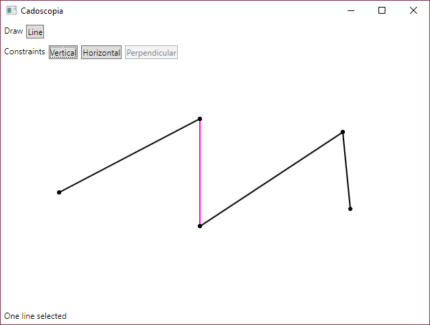

# Cadoscopia

CAD software written in 100% C#/.NET/WPF.

For now it only consists in a basic 2D sketcher.

Constraints supported:

- Horizontal
- Vertical
- Perpendicular
- Parallel

Drawing primitives:

- Line